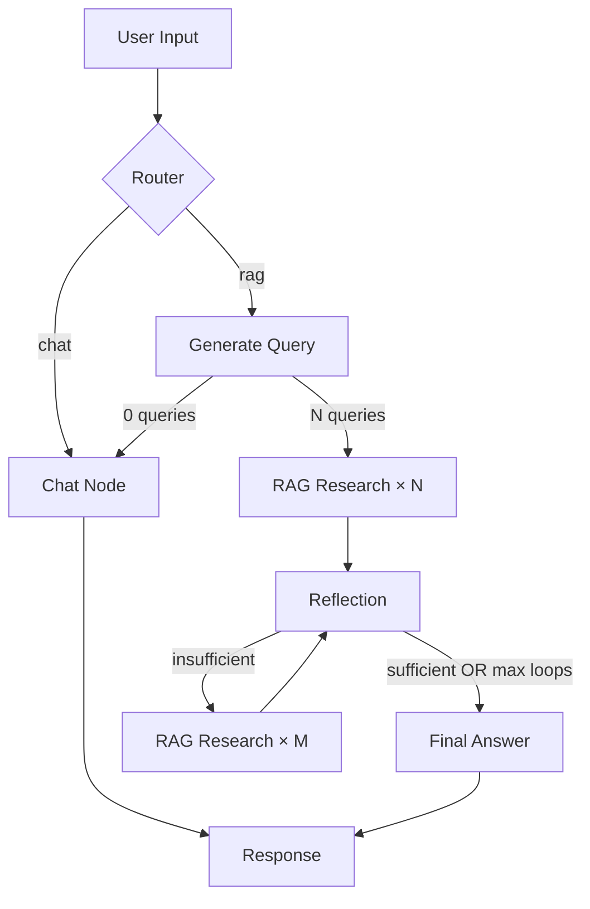

# Shyn AI

An **intelligent Retrieval-Augmented Generation (RAG)** system powered by a LangGraph-based agent that iteratively searches, evaluates, and synthesizes information from a document knowledge base. Built with local LLMs and vector search.

---

## Key Features

- **Agentic RAG Loop** — Autonomous multi-round search with self-evaluation and adaptive query refinement
- **Bilingual Queries** — Always generates 1 English + 1 user-language query for best document coverage
- **Real-Time Streaming** — SSE-based streaming UI showing each agent step (query generation, search, reflection, answer)
- **Smart Intent Routing** — LLM-based router distinguishes between document queries and general conversation
- **Persistent Conversations** — SQLite-backed session and conversation history with per-conversation message storage
- **Long-Term Memory** — LLM-extracted memories stored in Qdrant as vectors, retrieved semantically across sessions
- **Memory-Aware Prompts** — Every agent node (router, query generation, reflection, answer, chat) injects relevant memories for personalization
- **Local-First** — All models run locally via llama.cpp + Qdrant; no cloud dependencies
- **Relevance Guard** — Post-retrieval keyword filter prevents hallucination from semantically mismatched documents
- **Configurable** — Model selection, RAG loop count, query count all adjustable per request

---

## Architecture



### Technology Stack

| Component | Technology |
|---|---|
| **LLM** | Qwen3.5-4B-Q4_K_M via llama.cpp (OpenAI-compatible API) |
| **Embeddings** | Qwen/Qwen3-Embedding-0.6B (SentenceTransformers, 1024-dim) |
| **Vector DB** | Qdrant (local, cosine distance) — document & memory collections |
| **Conversation Store** | SQLite (`data/conversations.db`) |
| **Orchestration** | LangGraph (StateGraph + Send fan-out) |
| **API** | FastAPI + Server-Sent Events (SSE) |
| **Frontend** | Single-page HTML chat interface |
| **Text Splitting** | LangChain RecursiveCharacterTextSplitter |

---

## Prerequisites

- Python 3.14+
- [Qdrant](https://qdrant.tech/) running on `localhost:6333`
- llama.cpp server (or compatible OpenAI-API endpoint) serving a GGUF model
- Documents to index (place in a folder, default: `documents/`)

---

## Setup

1. **Clone and install dependencies**
   ```bash
   git clone https://github.com/shynneri-source/agentic_rag.git
   cd agentic-rag
   uv sync  # or: pip install -r requirements.txt
   ```

2. **Configure environment**
   ```bash
   cp .env.example .env
   # Edit .env with your LLM server URL, API key, etc.
   ```

   See `.env.example` for all available configuration options:
   ```
   LLM_BASE_URL=http://localhost:8000/v1
   LLM_API_KEY=not-needed
   LLM_MODEL=Qwen3.5-4B-Q4_K_M.gguf
   QDRANT_HOST=localhost
   QDRANT_PORT=6333
   ```

3. **Index documents** into the vector database:
   ```bash
   python rag/documents_processing.py   # chunk documents → documents_chunks.json
   python rag/documents_embedding.py    # embed chunks → Qdrant
   ```

4. **Start the web server**:
   ```bash
   python app.py
   ```
   Open `http://localhost:3000` in your browser.

5. **Or run the CLI**:
   ```bash
   python example.py
   ```

---

## Configuration

Configuration is managed through environment variables (`.env` file) and overridable per-request via the API:

| Variable | Default | Description |
|---|---|---|
| `LLM_BASE_URL` | `http://localhost:8000/v1` | LLM API endpoint |
| `LLM_API_KEY` | `not-needed` | LLM API key |
| `LLM_MODEL` | `Qwen3.5-4B-Q4_K_M.gguf` | Model name |
| `LLM_TEMPERATURE` | `0.7` | Sampling temperature |
| `QDRANT_HOST` | `localhost` | Qdrant server host |
| `QDRANT_PORT` | `6333` | Qdrant server port |
| `QDRANT_COLLECTION` | `document_embeddings` | Qdrant collection name |
| `EMBEDDING_MODEL` | `Qwen/Qwen3-Embedding-0.6B` | SentenceTransformer model |
| `MAX_RAG_LOOPS` | `3` | Max RAG evaluation cycles |
| `NUMBER_OF_INITIAL_QUERIES` | `2` | Initial search queries per question |

**Qdrant & LLM** settings are configured via `.env` (see `.env.example` for all options).

---

## API

### `POST /api/chat`

Standard request-response chat:

```json
{
  "message": "Your question here",
  "config": {}
}
```

### `POST /api/chat/stream`

SSE-streamed chat with real-time agent progress. Events:

| Event | Description |
|---|---|
| `thinking` | Agent initializing and analyzing question |
| `query_generation` | Generated search queries (1 EN + 1 user language) |
| `rag_search` | Search query + results count |
| `reflection` | Evaluation status + knowledge gap |
| `answer` | Final answer text with sources |
| `complete` | Processing stats |
| `error` | Error message |

### Conversation & Session Management

| Endpoint | Method | Description |
|---|---|---|
| `/api/chat/sessions?session_id=...` | GET | List all conversations for a session |
| `/api/chat/history?conversation_id=...` | GET | Get full message history for a conversation |
| `/api/chat/sessions/{conversation_id}` | DELETE | Delete a conversation and its memories |
| `/api/chat/history?session_id=...` | DELETE | Clear all conversations for a session |

### Memory Management

| Endpoint | Method | Description |
|---|---|---|
| `/api/memories?session_id=...` | GET | List all long-term memories |
| `/api/memories/search?session_id=...&query=...` | GET | Search memories semantically |
| `/api/memories/{memory_id}` | DELETE | Delete a specific memory |
| `/api/memories?session_id=...` | DELETE | Clear all memories for a session |

### Health

| Endpoint | Method | Description |
|---|---|---|
| `/api/health` | GET | Health check |

---

## Project Structure

```
agentic-rag/
├── agent/                      # LangGraph agent
│   ├── agent.py                # Graph definition & nodes
│   ├── config.py               # Configuration schema
│   ├── prompt.py               # All prompt templates
│   ├── schema.py               # Pydantic models
│   ├── states.py               # TypedDict state definitions
│   └── utils.py                # Helper functions
├── core/
│   └── model.py                # LLM, Embedding & RAG engine (ModelManager)
├── store/                      # Persistence layer
│   ├── conversation_store.py   # SQLite-backed conversation history
│   ├── memory_store.py         # Qdrant-backed long-term memory
│   └── memory_extractor.py     # LLM-based memory extraction
├── rag/
│   ├── documents_processing.py # Document chunking pipeline
│   └── documents_embedding.py  # Embedding generation & Qdrant upsert
├── documents/                  # Place your source documents here
├── data/                       # Auto-created SQLite database directory
├── app.py                      # FastAPI server + SSE streaming
├── example.py                  # CLI interactive agent
├── process_questions.py        # Batch question processor
├── static/
│   └── index.html              # Frontend chat UI
├── documents_chunks.json       # Pre-chunked documents
├── pyproject.toml              # Project metadata & dependencies
└── system.md                   # Detailed NLP & system documentation
```

---

## How It Works

1. **Context Loading**: On each request, the system loads recent conversation history (last 10 messages from SQLite) and semantically relevant long-term memories (from Qdrant) to inject as context.

2. **Router**: Classifies the user's question as needing document search (`rag`) or general conversation (`chat`). The router receives memories and history for context.

3. **Query Generation**: For RAG questions, the LLM generates 2 search queries (1 English + 1 in the user's language) optimized for vector retrieval, informed by memories and history.

4. **Parallel Search**: Each query searches Qdrant's document vector database. The top result is returned as raw document content (not LLM-summarized).

5. **Relevance Filter**: A keyword-overlap check validates that the retrieved document actually relates to the query, preventing hallucination from semantically mismatched matches.

6. **Reflection**: The LLM evaluates all accumulated content against the original question. If information is insufficient, it generates follow-up queries. Up to `max_rag_loops` cycles.

7. **Final Answer**: The LLM synthesizes a final answer (in the user's language) with source citations from all retrieved documents.

8. **Persistence**: After each response, the user message and assistant response are stored in SQLite. A background task then uses the LLM to extract any salient facts (preferences, goals, personal context) and stores them as vector memories in Qdrant for future conversations.

### llama.cpp Server

Start the llama.cpp server with reasoning disabled:

```bash
./llama-server -m Qwen3.5-4B-Q4_K_M.gguf --reasoning off --port 8000
```

---

## License

MIT
